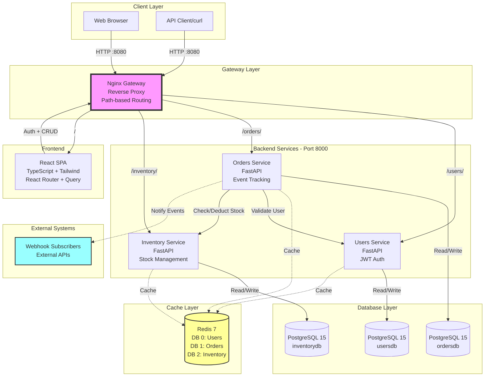
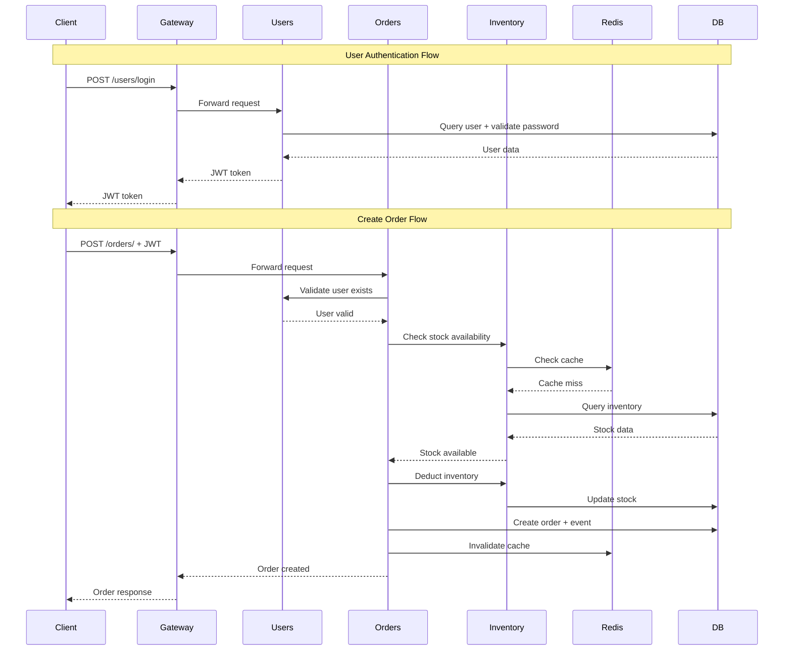
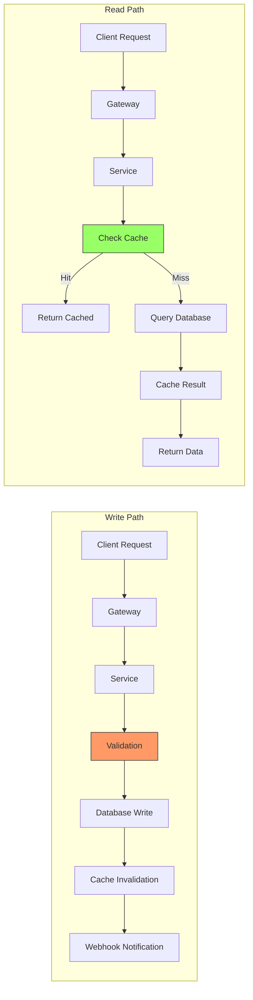
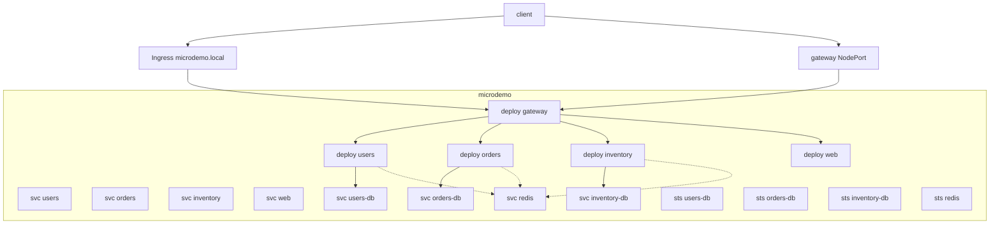
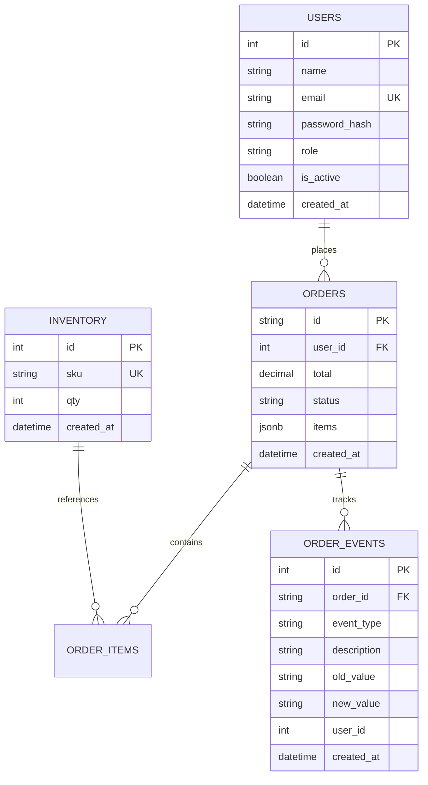
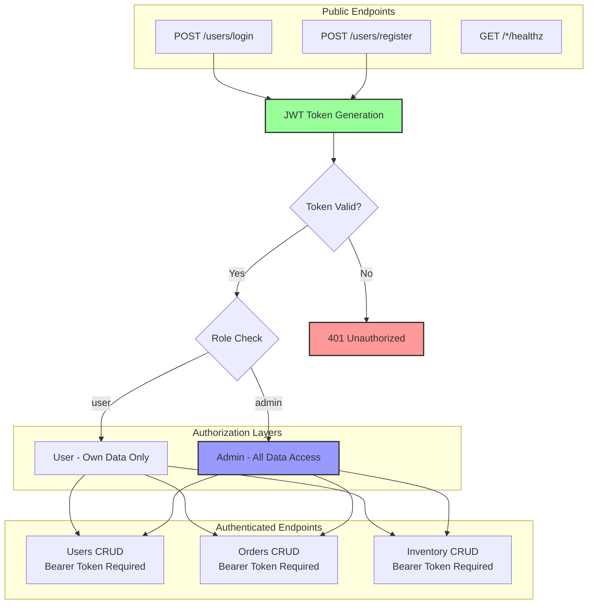
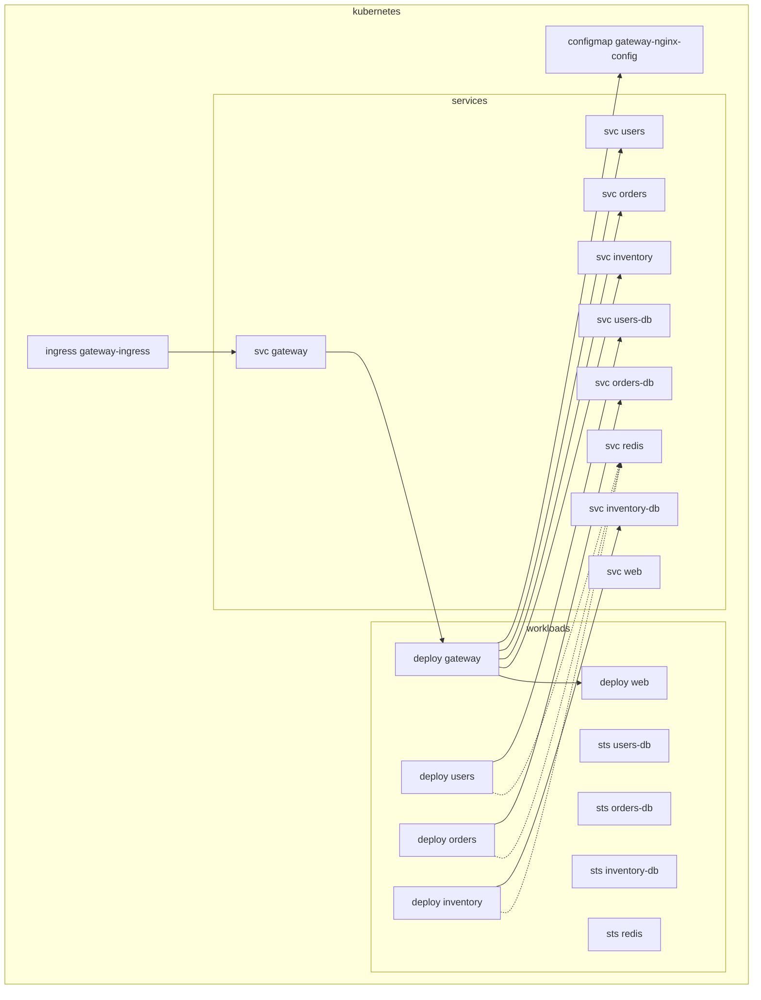

# Architecture Diagram

> Kubernetes quick-start ([README](README.md#quick-start-minikube))
>
> - minikube start --kubernetes-version=stable
> - make build apply wait
> - Access ([details](README.md#access-options)):
>   - NodePort: http://$(minikube ip):30080/
>   - Ingress: make ingress-enable && make ingress-apply, then http://microdemo.local/
>   - Dev port-forward: make dev (opens http://127.0.0.1:8080)
> - Seed demo data: make seed
> - Switch images: make deploy-ghcr GHCR_NS=<ns> TAG=<tag>

## System Overview

## Request Flow

## Data Flow Architecture

## Kubernetes Networking

Notes
- Internal DNS: services resolve as users.microdemo.svc.cluster.local, etc. In nginx.conf we refer to short names (users, orders, inventory, web) within the namespace.
- Databases and Redis run as StatefulSets behind headless Services for stable network IDs and persistent volumes.
- External access: either NodePort 30080 or Ingress host microdemo.local (via hosts entry or minikube tunnel).

## Component Details

### Services

| Service | Port | Database | Redis DB | Key Features |
|---|---:|---|---|---|
| Gateway | 80 | - | - | Nginx reverse proxy, path routing |
| Users | 8000 | usersdb | 0 | JWT auth, role-based access |
| Orders | 8000 | ordersdb | 1 | Event tracking, webhooks, validation |
| Inventory | 8000 | inventorydb | 2 | Stock management, auto-deduction |
| Web | 80 | - | - | React SPA, lazy loading |
| Redis | 6379 | - | 0,1,2 | Caching layer |

### Databases

| Database | User | Port | Health Check |
|---|---|---:|---|
| users-db | users | 5432 | pg_isready -U users -d usersdb |
| orders-db | orders | 5432 | pg_isready -U orders -d ordersdb |
| inventory-db | inventory | 5432 | pg_isready -U inventory -d inventorydb |
### Data Models

## Security Architecture

## Deployment View (Kubernetes)

Operational notes
- Liveness/Readiness: all app Deployments expose /healthz for probes.
- Persistence: PostgreSQL and Redis use PersistentVolumeClaims via StatefulSets.
- Config: nginx.conf mounted from a ConfigMap; app env (DATABASE_URL, REDIS_URL, JWT_SECRET_KEY) set in Deployment env.
- Build/Images: for dev, images are built into Minikube; for sharing, CI publishes GHCR images. Use overlays to switch.

## Key Design Patterns

1. **API Gateway Pattern**: Single entry point (Nginx) for all client requests
2. **Database per Service**: Each microservice has its own database for independence
3. **Service Discovery**: Kubernetes DNS (svc-name.namespace.svc) instead of Docker DNS
4. **Event Sourcing**: Order events tracked in separate table for audit trail
5. **Cache-Aside Pattern**: Check cache first, query DB on miss, update cache
6. **Resilience with Probes**: Readiness/Liveness probes with /healthz
7. **Webhook Pattern**: Async notifications to external systems
8. **JWT Token Authentication**: Stateless authentication across services
9. **Role-Based Access Control (RBAC)**: User vs Admin authorization
10. **Health Check Pattern**: All services expose health endpoints
11. **Overlays for Images**: Kustomize overlays to switch between local and GHCR images

## Performance Characteristics

- **Frontend Bundle**: Code-split by route with lazy loading
- **Database Queries**: Indexed on frequently queried columns
- **Caching Strategy**: 5-minute stale time, 10-minute garbage collection
- **Service Communication**: Async HTTP with connection pooling
- **Webhook Delivery**: Fire-and-forget with 5-second timeout
- **Database Connections**: Connection pooling via SQLAlchemy

## Scalability Considerations

- **Horizontal Scaling**: Services are stateless (except databases)
- **Load Balancing**: Nginx can distribute to multiple service instances
- **Database Sharding**: Each service has separate database
- **Cache Layer**: Redis can be clustered for high availability
- **CDN**: Static assets can be served via CDN
- **Queue**: Future: Add message queue for async processing
